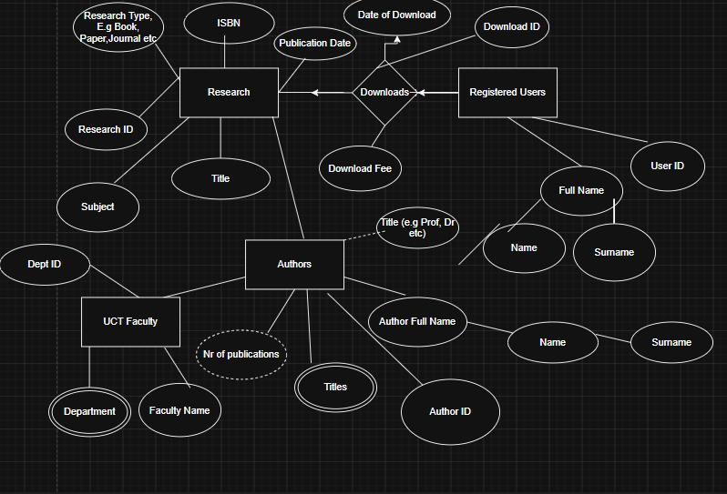

## Question 1

a\) Entity Diagram

b)

-   Research ( $\underline{\text{Research ID}}$ ,AUTHOR ID, Subject, Title, Publication Date, Research Typ

-   Authors ($\underline{\text{Author ID}}$ Title, DEPTID, Faculty)

-   Downloads ($\underline{\text{Download ID}}$, USER ID, Download Date, Download Fee)

-   Registered Users ( $\underline{\text{UserId}}$, DOWNLOAD ID, Name, Surname)

-   Faculty ( $\underline{\text{DeptID}}$, Department, Faculty Name)

c\) Author ID==\>Author Name

d\) A functional dependency helps determine new information in a row of data. Knowing about an ID A determines information about B, another attribute in the row.

e\) AuthorID -\> Department

f\) Think

g\) Research ID has a many-to-many relation to User ID ( multiple Research IDs cand be downloaded by multiple users and vice versa). The relation is 3NF due to the lack of transitive dependencies/partial dependencies. \* comeback and explain why

# Question 2

a\) Fact Table candidates- Downloads (central table for which can track multiple attributes including download date, user, VookId, etc.), AuthorS could also be a fact table

b\)

-   Downloads ( Download ID, Download Date, UserID, Research ID, Author ID)

-   Authors (AuthorID, Name, Surname, Faculty, Research Titles)

c\) UCT Faculty- one-dimensional table that is slow changing.

d\) Faculty -\>Department. Faculties house multiple departments, which in this case form a hierarchy

```{SQL}
SELECT Subject,ReasearchType,
COUNT(ResearchID)
GROUP BY CUBE (FacultyName, Department)
```

The above gives the number of authors per Subject-ResearchType combination as well as the number of Research Ids across Subjects alone and across Research Types (e.g book, paper, thesis) as well.

f\) The Research Type rows would disappear as this detail would be "rolled up" into the Subject totals, which form the hierarchy in this example.

# Question 3

a\) I would make use of a relational database to store easily definable attributes of research outputs. That would be for the Author and Research fact tables that relate to their respective dimension tables.

b\) The key-value store should be a simple look up dictionary where the key instantly returns a value stored for that key. In this case. Given that the number of registered users would naturarally tend to grow much quicker relative to other datasets (given the popularity of the research platform) this would be what I would use to store user related information - ideally user names.

c\) I would use the a document database to store the actual content of all the reasearch IDs; The research ID would be the key in this case. These databases are best for semi-structured data and as such would suit the various types of formats that research outputs can take.

d\) I would use a column-oriented database to store Research ID interactions with respect to downloads, citations etc. make it easy to track and evaluate user analytics

e\) Authors and their collaborators that they have worked or cited in works- can be useful for tracking research similarity.

# Question 4

a\) Inputs : Users, Payments, Date/month

Outputs: Total Pyment per user

Mappers- will take each user/date combination as a key and output a payment value \<user-date, payment\>

Then each reducer will take the each user-date key and its associated value the one reducer that will handle the summing of the payments for that pair.
